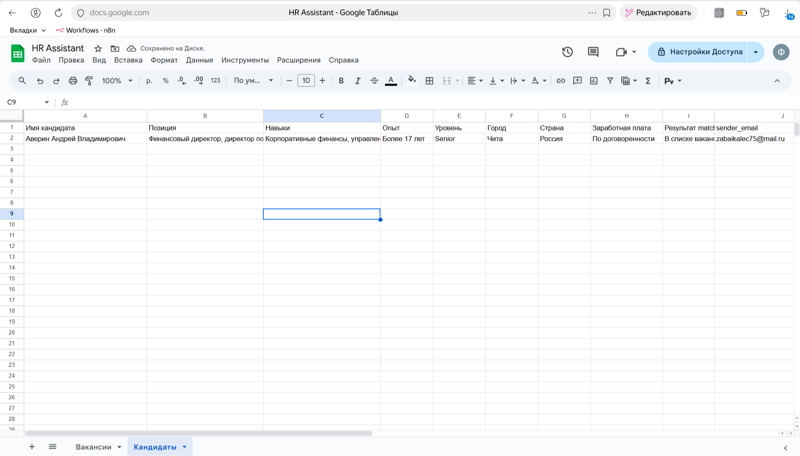

# AI HR Assistant

Автоматизированный HR-пайплайн на базе n8n и OpenAI. Система обрабатывает входящие резюме через Gmail, извлекает данные из PDF, структурирует информацию с помощью LLM, сопоставляет кандидатов с вакансиями и отправляет автоматический ответ.

## Бизнес-задача

Сокращение ручного труда рекрутера: автоматический приём резюме по почте, парсинг и структурирование данных кандидата, сопоставление с открытыми вакансиями, проверка на дубликаты и запись результатов в таблицу с последующей автоматической отправкой ответа кандидату.

## Архитектура workflow

1. **Gmail Trigger** — получение новых писем с вложениями (резюме).
2. **Извлечение текста из PDF** — парсинг вложенных PDF-файлов.
3. **AI-анализ** — извлечение структурированных данных кандидата (имя, контакты, опыт, навыки) через OpenAI.
4. **Matching с вакансиями** — сопоставление профиля кандидата со списком вакансий.
5. **Расчёт score** — оценка степени совпадения кандидата с каждой вакансией.
6. **Проверка дубликатов** — проверка по email, чтобы не обрабатывать повторные отклики.
7. **Запись в Google Sheets** — сохранение результата (кандидат, вакансия, score) в таблицу.
8. **Отправка письма** — автоматическая отправка ответа кандидату (подтверждение приёма резюме или следующий шаг).

## Стек

| Компонент | Назначение |
|-----------|------------|
| **n8n** | Оркестрация workflow |
| **OpenAI API** | Извлечение и структурирование данных из резюме (LLM) |
| **Gmail API** | Триггер входящих писем, отправка ответов |
| **Google Sheets API** | Хранение результатов matching и данных кандидатов |

## Скриншоты

### Workflow в n8n


### Результаты в Google Sheets



### Пример письма кандидату


## Структура репозитория

```
ai-hr-assistant/
├── README.md
├── workflow/
│   └── hr-assistant-workflow.json
├── docs/
│   └── screenshots/
│       ├── workflow.png
│       ├── google-sheets.png
│       └── email-response.png
├── sample-data/
└── .env.example
```

## Настройка и запуск

### 1. Переменные окружения

Скопируйте `.env.example` в `.env` и заполните значения (API-ключи OpenAI, учётные данные Gmail и Google Sheets — в n8n настраиваются через Credentials).

### 2. Импорт workflow в n8n

1. Откройте n8n.
2. Меню **Workflows** → **Import from File** (или `Ctrl+O` / `Cmd+O`).
3. Выберите файл `workflow/hr-assistant-workflow.json`.
4. После импорта откройте каждый узел с учётными данными (Gmail, OpenAI, Google Sheets) и привяжите или создайте нужные credentials.
5. Сохраните workflow и включите его (активируйте триггер).

После активации workflow будет обрабатывать новые письма с резюме по заданному сценарию.
